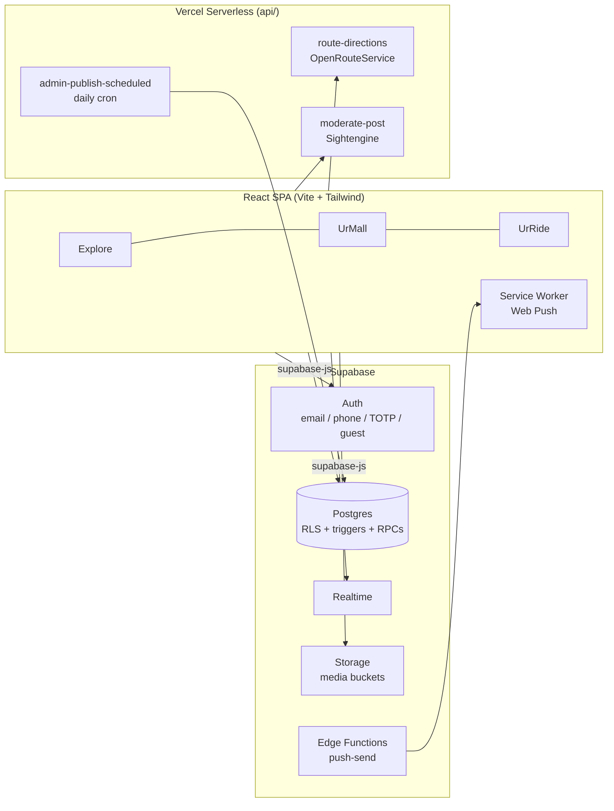

# KunThai

**One account. One platform. Social, commerce, and mobility for everyone.**

KunThai is a super-app that brings together three everyday services under a single identity, built with a global reach (252 countries supported) and a West African focus:

| Sector | What it does |
|---|---|
| 🌍 **Explore** | Social feed (UrFeed), short-form video (Swip), messaging, connections, community Spaces, and safety tools |
| 🛍️ **UrMall** | A full marketplace — buyers, seller storefronts, product catalogs, orders, delivery, and buyer–seller messaging |
| 🚖 **UrRide** | Ride and delivery booking — passengers, independent operators, company fleets, live trips, and map-based Area View |

Users sign up once, receive a unique **KunThai ID**, and move seamlessly between all three sectors with shared notifications, wallet, and safety infrastructure.

---

## ✨ Highlights

### Trust & authenticity by design
- **Verified reviews only** — store, product, and driver reviews can only be written by users with a real, seller-acknowledged order or an operator-accepted trip. This is enforced *in the database* with triggers and security-definer RPCs, so hiding the form is never the security boundary.
- **Verification workflows** for sellers, transport operators, and companies, backed by an admin case system.
- **Guest mode** lets visitors browse without an account while keeping registered users' social graph fully isolated from anonymous sessions.

### Growth without payments
- **Visibility Credits** — a non-monetary promotion currency. Each verified friend who joins through your invite link earns you 5 credits, spendable on advert and product visibility. Earning and spending are fully server-controlled.

### Global from day one
- **252-country coverage**: international dialing profiles, per-country feature configuration, currencies, and transport fleet types — all database-driven, never hardcoded.
- **Emergency contacts for every country**, with verified-source tracking and automatic provisioning when new countries are added.
- Phone sign-in with explicit country selection, per-country number validation, and OTP flows.

### Real-time, everywhere
- Live order, message, booking, and notification updates via Supabase Realtime, with polling fallback.
- Cross-sector activity host: UrMall and UrRide events surface as banners and badges even while you're in another sector.
- **Web Push** notifications through a dedicated service worker when the app is closed or in the background.

### Safety & security
- Row-Level Security on every table; policies fail closed.
- TOTP two-factor authentication, OTP abuse guards, and local-vs-global sign-out.
- A protected **admin workspace** (`/admin`) with role hierarchy (Super Admin → Chief Admin → scoped officers), two-admin approvals, undo rules, and immutable audit history.
- Server-side content moderation pipeline for uploaded media.

---

## 🏗️ Architecture



**Design principle:** the database owns the rules. Country availability, review eligibility, credit awards, admin authority, and count totals are all enforced by Postgres (RLS, triggers, security-definer functions). The frontend hydrates from the database and never trusts client state for anything security-relevant.

---

## 🧰 Tech Stack

| Layer | Technology |
|---|---|
| Frontend | React 18, Vite 7, Tailwind CSS, Framer Motion, Lucide icons |
| Maps | MapLibre GL + MapTiler styles, OpenRouteService directions |
| Backend | Supabase (Postgres, Auth, Storage, Realtime, Edge Functions) |
| Uploads | tus resumable uploads for large media |
| Serverless | Vercel functions (`api/`) for routing, moderation, and scheduled jobs |
| Notifications | Service worker + VAPID Web Push |
| Tooling | ESLint 9, PostCSS, Vercel deployment |

---

## 🚀 Getting Started

### Prerequisites
- Node.js 18+ (Vercel deployment targets Node 24)
- A Supabase project (free tier works)
- npm

### 1. Install

```bash
npm install
```

### 2. Configure environment

Create `.env.local` in this directory:

```bash
VITE_SUPABASE_URL=            # your Supabase project URL
VITE_SUPABASE_ANON_KEY=       # your Supabase anon key
VITE_MAPTILER_KEY=            # MapTiler API key (maps)
VITE_MAPTILER_STYLE_ID=streets-v2
VITE_CONTENT_MODERATION_ENABLED=false
```

Server-side (deployment-only) variables for the Vercel functions:

```bash
OPENROUTESERVICE_KEY=
KUNTHAI_CONTENT_MODERATION_ENABLED=false
SIGHTENGINE_USER=
SIGHTENGINE_SECRET=
SUPABASE_URL=
SUPABASE_SERVICE_ROLE_KEY=
CRON_SECRET=
```

> ⚠️ Never expose server-side keys with a `VITE_` prefix — anything prefixed `VITE_` is bundled into the browser build.

### 3. Set up the database

Apply the versioned migrations in `supabase/migrations/` (timestamp order) to your linked Supabase project:

```bash
supabase db push
```

### 4. Run

```bash
npm run dev
```

The app opens at `http://localhost:3000`. Use **Visit as guest** to browse instantly, or create an account for the full experience.

---

## 📜 Scripts

| Command | Purpose |
|---|---|
| `npm run dev` | Start the Vite dev server |
| `npm run build` | Production build |
| `npm run lint` | ESLint over the whole project |
| `npm run check` | Lint + build (CI-style validation) |
| `npm run preview` | Preview the production build locally |

---

## 🗄️ Database & Migrations

All reviewed schema changes are versioned SQL in `supabase/migrations/`. Notable pillars:

- **Admin foundation** — roles, cases, approvals, audit history, undo rules
- **Visibility credit wallet** — server-controlled earning and spending with advisory-lock safety
- **Global country rollout** — every dialing-profile country seeded with feature settings and emergency contacts (auto-synced by trigger when a country is added)
- **Guest connection isolation** — RLS that distinguishes anonymous visitors from registered users
- **Verified transaction reviews** — unforgeable seller-response / operator-acceptance markers gating all review creation

Review migrations before pushing to a production project, and apply them together in timestamp order.

---

## 🛡️ Admin Workspace

The protected admin workspace lives at `/admin` and provides case management (reports, verification, support, finance, safety), scoped officer assignment, SLA tracking, notification publishing, and audited feature controls.

Bootstrapping the first administrator is a deliberate manual step from a trusted SQL session:

```sql
select id, email from auth.users where lower(email) = lower('owner@example.com');

select public.bootstrap_kunthai_chief_admin(
  '<that-user-uuid>'::uuid,
  true   -- true = Super Admin, false = Chief Admin
);
```

All production administrators must complete TOTP multi-factor authentication.

For local development only, `/admin?preview=chief` opens a Chief Admin preview with sample data; production builds remove this path.

---

## 📁 Project Structure

```
web/
├── api/                  # Vercel serverless functions (routing, moderation, cron)
├── public/               # Static assets + service worker (sw.js)
├── src/
│   ├── components/
│   │   ├── Explore/      # Social feed, Swip video, messages, Spaces, profile
│   │   ├── Marketplace/  # UrMall buyer + seller experiences
│   │   ├── transport/    # UrRide passenger, operator, and company flows
│   │   ├── auth/         # Sign-in, 2FA, account recovery
│   │   ├── onboarding/   # First-run account setup
│   │   └── shared/       # Cross-sector UI (toasts, activity host, validation)
│   ├── Backend/          # Service layer (Supabase queries, hooks)
│   ├── admin/            # Admin workspace
│   └── data/             # Global country catalogs and feature availability
├── supabase/migrations/  # Versioned database schema
└── docs/                 # Engineering summaries and operating guides
```

---

## 🗺️ Roadmap & Known Limitations

- **Payments:** UrMall checkout currently confirms orders directly with the seller. Payment collection, settlement, and withdrawals await a payment-provider integration and are explicitly marked unavailable in the UI rather than simulated.
- **Media optimization:** client-side image compression and video size caps are planned to reduce bandwidth on low-data connections.
- **Emergency numbers:** globally seeded; country-by-country official verification (`source_url`, `verified_at`) is ongoing.

---

*Built with care for communities that deserve world-class software.*
