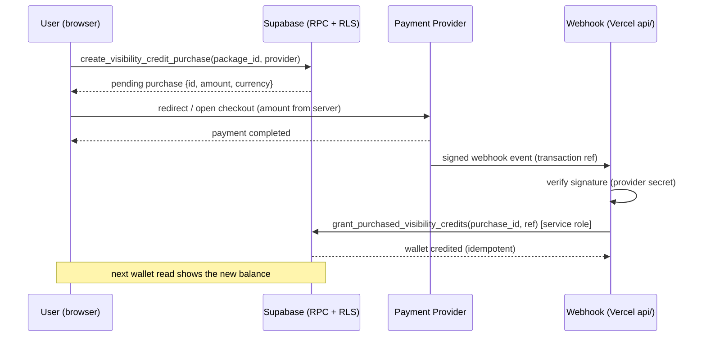

# Buying Visibility Credits — Design Guide

**Date:** 2026-07-21
**Status:** Guidance + reviewed DB foundation (not yet applied)

This document explains how to let a user **buy** Visibility Credits in addition to
**earning** them from invites, and what decisions you need to make first.

The reviewed database foundation lives in
[`docs/proposals/visibility_credit_purchases.sql`](./proposals/visibility_credit_purchases.sql).
It has been compiled and smoke-tested against the live database inside a
rolled-back transaction, but is **deliberately kept out of `supabase/migrations/`**
so it is not applied until you decide provider and pricing.

---

## 1. What already works (earning)

The invite-earn side is complete and live:

- A user creates an invite link (`create_visibility_invite_link`).
- A new verified user who joins through it triggers `finalize_visibility_invite`,
  which awards **5 credits** to the inviter and records an `invite_reward`
  transaction.
- Credits are spent on Explore adverts (`create_explore_ad_campaign`) and UrMall
  product boosts (`create_marketplace_visibility_promotion`), both routed through
  the server-controlled `spend_visibility_credits`.

Buying credits simply adds a **second way to fill the same wallet** — nothing about
spending changes.

---

## 2. Going global: no single provider covers all 252 countries

KunThai supports 252 countries, so "buy credits everywhere" cannot be one provider.
The honest reality:

- **No processor onboards a merchant in every country, and none accepts every local
  payment method.** Global coverage = **routing by the buyer's country** to the best
  available provider. The foundation already supports this — every purchase row
  stores its own `provider` and `currency`.
- Two different things are easy to confuse: (a) where **your business** can hold a
  merchant account and receive payouts, and (b) where **your buyers** can pay from.
  A Sierra Leone-registered business has limited direct access to Stripe/Paddle, but
  can still accept worldwide cards through the right provider.

### Recommended global setup: two providers, one wallet

| Segment | Provider | Why |
|---|---|---|
| **Africa** (cards, bank, mobile money, USSD) | **Flutterwave** | Widest African reach incl. Sierra Leone/Nigeria/Ghana mobile money — the methods your core users actually have. |
| **Rest of the world** (135+ currencies, cards, Apple/Google Pay) | **Stripe Checkout** *or* a **Merchant-of-Record** (Paddle / Lemon Squeezy / Polar) | Accepts cards from virtually every country. A Merchant-of-Record additionally handles global sales-tax/VAT for you — ideal for a digital good like credits. |

**How routing works:** you already know the buyer's country (`activeCountryIso` /
account metadata). At checkout, pick the provider:

```
provider = isAfricanMoMoCountry(buyerCountry) ? "flutterwave" : "stripe"
```

Everything downstream is identical — both providers' webhooks call the same
`grant_purchased_visibility_credits`, and both fill the same wallet.

### Currency: price once in USD, sell everywhere

The simplest global model is a **USD base price**. Both Stripe and Flutterwave accept
a USD charge and let the buyer's bank/card do the conversion, so you don't have to
maintain 150 price lists. Optionally add local-currency packages for your biggest
markets (e.g. NGN, GHS, SLE) for friendlier pricing — the `visibility_credit_packages`
table already has a `currency` column, so this is just extra rows, no code change.

> A Merchant-of-Record (Paddle/Lemon Squeezy/Polar) is worth serious consideration
> for the worldwide segment: they become the legal seller, so **they** handle tax
> registration and remittance in every country you sell to — which is otherwise a
> real burden when your customers span 252 jurisdictions. Trade-off: higher fees
> and their own list of supported *seller* countries to check against your business's
> registration.

> Good news for the hackathon: buying credits is a *much* safer first payment
> surface than UrMall checkout. There's no seller settlement, escrow, refunds, or
> payout — the user pays you, you add a number to their wallet. It's the ideal
> place to prove your payment integration.

---

## 3. Architecture (money never touches the browser)



**Non-negotiable rules baked into the foundation:**

1. **The server sets the price.** The client only sends a `package_id`; the amount
   comes from the `visibility_credit_packages` table. A user can never choose their
   own price.
2. **Credits are granted only by the webhook**, using the service-role key.
   `grant_purchased_visibility_credits` is revoked from `anon` and `authenticated` —
   the browser can never call it.
3. **Idempotent crediting.** The grant is keyed on the purchase row and short-circuits
   if already `paid`, so a provider retrying the webhook (they all do) never
   double-credits. This is verified by the smoke test.
4. **Verify the webhook signature** before trusting anything. Never credit on a
   client "payment success" callback alone — those can be forged.

---

## 4. What the DB foundation gives you

Applying `visibility_credit_purchases.sql` (after you set pricing) creates:

- `visibility_credit_packages` — what a user can buy and for how much (server-authoritative). **Edit the seed rows to real prices before applying.**
- `visibility_credit_purchases` — one row per checkout; `provider_reference` is the idempotency key.
- `create_visibility_credit_purchase(package_id, provider)` — client-callable; makes a pending purchase at the server's price.
- `grant_purchased_visibility_credits(purchase_id, ref)` — service-role only; idempotently marks paid + credits the wallet + logs a `purchase` transaction.
- Adds `'purchase'` to the allowed credit transaction types (while preserving the existing `starter_bonus` type already in the live table).

---

## 5. What still needs building (for global coverage)

1. **Set real pricing** — a USD package set for worldwide buyers, plus optional
   local-currency packages (NGN/GHS/SLE…) for your biggest markets. Just rows in
   `visibility_credit_packages`.
2. **Country → provider routing** — one small helper (`africanMoMo → flutterwave`,
   else `stripe`). The buyer's country is already known client-side; the webhook
   trusts only the `provider` stored on the purchase row.
3. **One webhook per provider** — `api/flutterwave-webhook.js` and
   `api/stripe-webhook.js` (Vercel). Each verifies its provider's signature, looks
   up the purchase by `provider_reference`, and calls
   `grant_purchased_visibility_credits` with the service-role key. Both fill the same
   wallet, so the rest of the app is provider-blind.
4. **Payment init per provider** — a small `api/` endpoint that opens the provider's
   checkout for a pending purchase at the server-set amount (Stripe Checkout Session
   / Flutterwave payment link).
5. **UI**: a "Buy credits" panel next to the existing "Share to earn" action on the
   profile Visibility Credits card — list packages in the buyer's currency, start
   checkout, show a success state on return.
6. **Environment secrets** (server-only, never `VITE_`):
   `FLUTTERWAVE_SECRET_KEY`, `FLUTTERWAVE_WEBHOOK_HASH`, `STRIPE_SECRET_KEY`,
   `STRIPE_WEBHOOK_SECRET` (or a Merchant-of-Record's equivalents).

Adding a third provider later (a local aggregator, PayPal, a Merchant-of-Record) is
one more webhook + init + a routing line — **no schema change**, because the ledger
is provider-agnostic. When you confirm the provider pair and pricing, I can build
steps 1–5 end to end.
