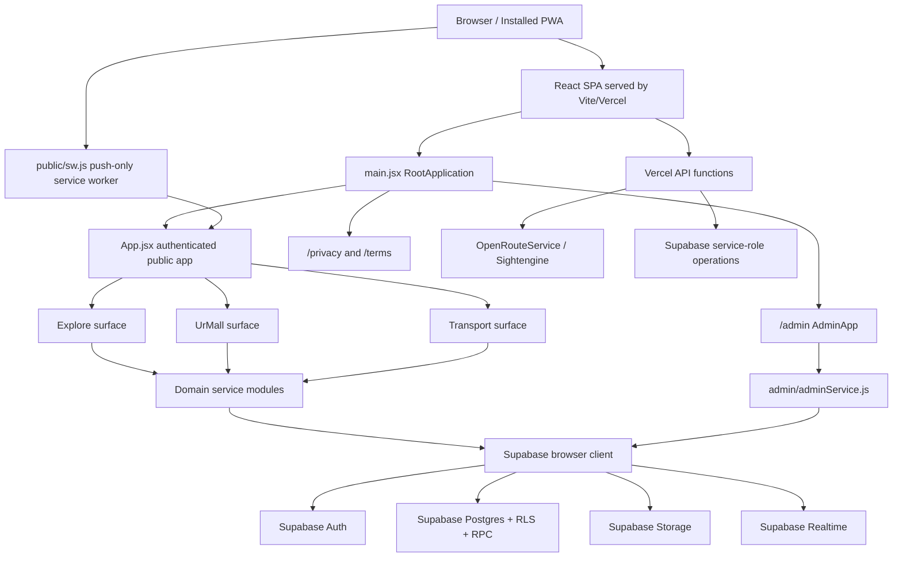
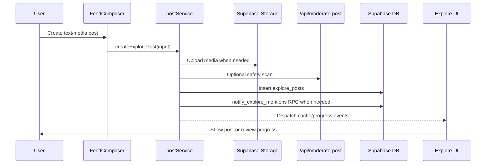
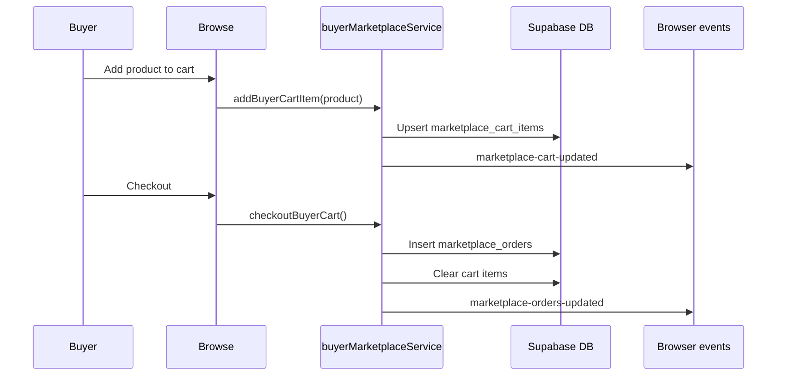
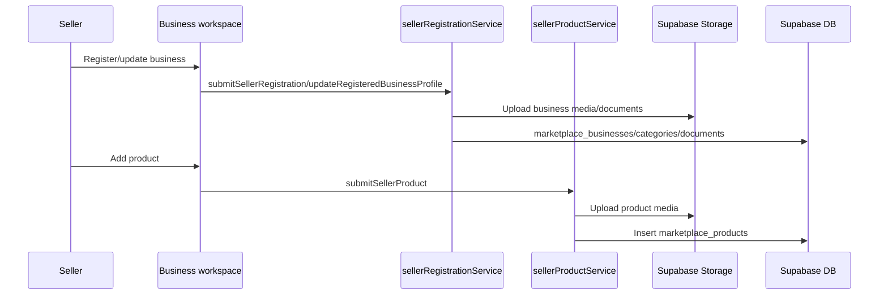
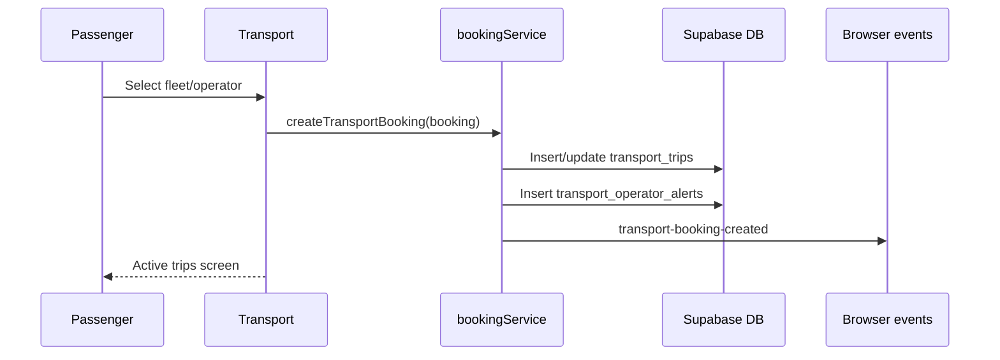
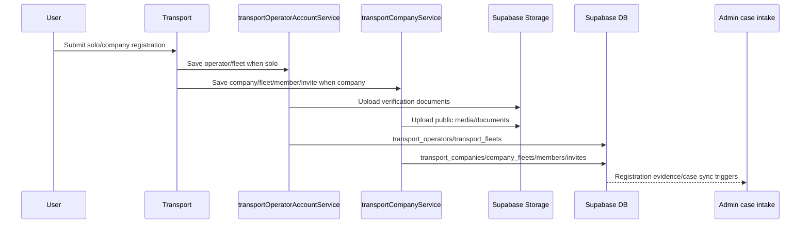
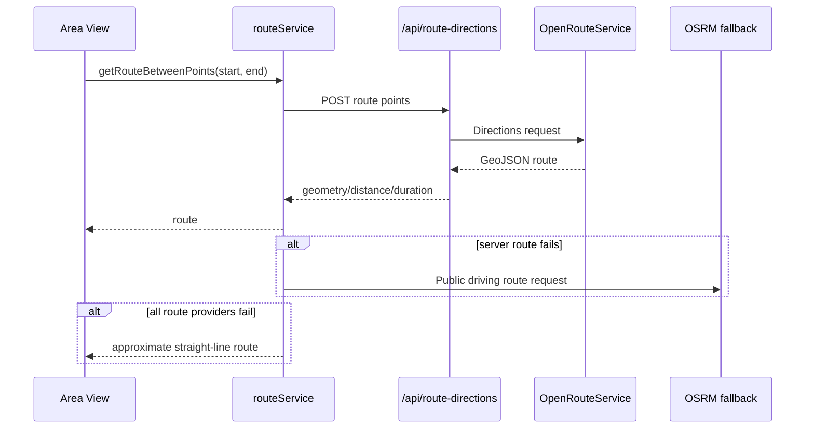

# KunThai App Architecture

Last updated: 2026-07-09

This document describes the architecture currently present in the KunThai web application. It is based on the files under `web/`, including the React/Vite app, Supabase service layer, Vercel API functions, public PWA assets, and Supabase migrations.

## Executive Summary

KunThai is a Vite + React single page application with three primary user surfaces:

- Explore: social feed, Swip video, connections, messages, profiles, notifications, saved posts, safety, support, preferences, and ads.
- UrMall: marketplace browsing, buyer cart/orders/messages, seller onboarding, seller workspace, products, vertical businesses, bookings, customer care, insights, promotions, and seller controls.
- Transport: passenger booking, deliveries, saved places/operators, active trips, Area View, operator registration/dashboard, fleet profiles, transport company workspace, company/operator invites, booking rosters, verification, and live trip flows.

The main backend is Supabase:

- Supabase Auth handles email, phone/password, SMS OTP, OAuth, and anonymous guest sessions.
- Supabase Postgres stores domain data for Explore, UrMall, Transport, Admin, notifications, account controls, recommendations, adverts, support, and user care.
- Supabase Storage stores media and verification documents.
- Supabase Realtime is used for selected live updates.
- Supabase RPC functions implement permission-sensitive operations, search/recovery checks, admin workflows, recommendations, adverts, transport lookups, and account lifecycle actions.

Vercel serverless functions are used where secrets or server-side execution are required:

- `api/route-directions.js`: protected OpenRouteService routing proxy.
- `api/moderate-post.js`: optional content moderation proxy using local text rules and Sightengine.
- `api/admin-publish-scheduled.js`: scheduled admin notification publication using a service-role Supabase client.

The application is mobile-first and PWA-capable. The service worker intentionally handles push notifications only and does not cache fetch responses, so deployments are always served live by the hosting platform.

## High-Level Runtime Diagram



## Technology Stack

Core runtime:

- React 18 with JSX.
- Vite 7 build/dev server.
- Tailwind CSS 3 with global CSS in `src/index.css`, `src/App.css`, `src/styles/bankTheme.css`, and `src/styles/appearance.css`.
- Supabase JS v2 for auth, database, storage, RPC, and realtime.
- React Router DOM is installed, but the main app uses custom path/hash/browser event navigation rather than a central React Router route tree.
- Framer Motion and local motion helpers support page transitions and screen animations.
- Lucide React and React Icons provide iconography.
- MapLibre GL powers map rendering.
- Tus JS Client is present in dependencies for resumable upload support, although the scanned code does not show a direct import.
- Lottie React is available for animated assets.

Build/runtime scripts in `web/package.json`:

- `npm run dev`: starts Vite.
- `npm run build`: production build.
- `npm run lint`: ESLint.
- `npm run check`: lint plus build.
- `npm test`: currently aliases `npm run check`.

Vite config:

- Development and preview host on `0.0.0.0`, port `3000`.
- Production build manually chunks `maplibre-gl`, `framer-motion`, React, Supabase, and vendor icon/animation packages.
- Chunk warning limit is raised to `1100`.

## Repository Map

Important paths:

- `web/src/main.jsx`: root entry point, global providers, service worker registration, route split for admin/policy/public app.
- `web/src/App.jsx`: authenticated public app shell, onboarding gate, account restriction gate, main surface navigation.
- `web/src/Login.jsx`: sign-in/sign-up/guest entry UI.
- `web/src/admin/`: protected admin workspace.
- `web/src/components/Explore/`: Explore UI surface.
- `web/src/components/Marketplace/`: UrMall buyer/seller UI surface.
- `web/src/components/transport/`: Transport UI surface.
- `web/src/components/shared/`: shared UI utilities, portals, back tabs, banners, guest gate, motion helpers.
- `web/src/components/services/`: transport-specific service modules used by Transport components.
- `web/src/Backend/lib/supabaseClient.js`: Supabase browser client singleton.
- `web/src/Backend/hooks/`: domain hooks wrapping service calls and UI state.
- `web/src/Backend/services/`: app-wide, Explore, marketplace, notification, session, account, and utility services.
- `web/src/data/`: static country, topic, and emergency contact data.
- `web/src/config/`: feature config such as content moderation.
- `web/api/`: Vercel serverless functions.
- `web/public/`: PWA manifest, icons, and service worker.
- `web/supabase/migrations/`: versioned SQL migrations.
- `web/docs/`: project documentation.

Notable top-level files currently present but not imported by the main shell:

- `web/src/Navigation.jsx`
- `web/src/Profile.jsx`
- `web/src/components/login.jxs`

These appear to be legacy/demo or inactive files unless another build path references them outside the current scanned entry points.

## Application Entry And Routing

### `main.jsx`

`src/main.jsx` is the root browser entry. It:

- Imports global CSS and theme CSS.
- Registers the push-only service worker through `registerKunThaiServiceWorker()`.
- Wraps the app in:
  - `AppErrorBoundary`
  - `AppearanceProvider`
  - `ToastProvider`
- Chooses the app branch using `window.location.pathname`:
  - `/admin` and `/admin/*` lazy-load `admin/AdminApp.jsx`.
  - `/privacy` and `/terms` lazy-load `components/public/PublicPolicyPage.jsx`.
  - Everything else renders `App.jsx`.

There is no top-level React Router tree. The app branch is selected imperatively by pathname, and the inner app uses state, hash handling, browser history helpers, and custom events.

### `App.jsx`

`src/App.jsx` is the public app shell. It manages:

- Auth state with `useAuth()`.
- Onboarding state with `useOnboarding(user)`.
- Current main page among `explore`, `marketplace`, and `transport`.
- Main page lazy loading for Explore, Marketplace, and Transport.
- Last page, visit counts, and marketplace navigation using local/session storage.
- Account restrictions from `platform_account_controls`.
- Anonymous guest state and guest-session cleanup.
- Notification banner host.
- Bottom tab visibility.
- Swipe navigation between main pages.
- Cross-surface events:
  - `kuntai-open-area-view`
  - `kuntai-return-main-page`

Main page logic:

- First render prefers a hash-derived page or the last stored main page.
- After a fresh sign-in, it chooses onboarding primary surface, hash page, frequent page, or last page.
- A hard refresh in the same browser tab keeps session continuity and restores the previous page instead of resetting.
- Bottom tabs are hidden when full-screen overlays are open in Explore, nested buyer/seller screens are open in UrMall, or Transport activity screens are open.

### Admin and Public Policy Paths

The `/admin` path is isolated from the public app and lazy-loaded. It still uses the shared Supabase auth hook, but it performs a separate admin access check before rendering the workspace.

The `/privacy` and `/terms` paths lazy-load the public policy page and bypass the authenticated app shell.

## Global Providers And Shared Runtime

### Appearance

`components/AppearanceProvider.jsx` owns light/dark/system mode:

- Reads `APPEARANCE_STORAGE_KEY` from local storage.
- Watches `prefers-color-scheme`.
- Applies `dark` class and `data-appearance` attributes to `document.documentElement`.
- Updates the browser `theme-color` meta tag.

### Toasts

`components/Explore/shared/ToastProvider.jsx` listens for `kuntai-toast` events emitted by `Backend/services/toastService.js`.

It renders up to four floating toast notifications with tones for info, success, warning, danger, and error.

### Error Boundary

`AppErrorBoundary` in `main.jsx` catches render failures and shows a recovery screen instead of a blank app.

### Service Worker And Push

`public/sw.js`:

- Installs and activates immediately.
- Handles Web Push payloads.
- Shows browser notifications.
- Routes notification clicks to an existing app window or opens a new one.
- Posts `kunthai-notification-click` messages back to the app.
- Does not cache fetch responses.

`Backend/services/pushService.js`:

- Registers the service worker.
- Checks browser support and VAPID public key availability.
- Enables/disables device push subscriptions.
- Stores subscriptions in `push_subscriptions`.
- Routes notification click targets to Explore Messages, Explore Notifications, UrMall orders, or a URL.

### Notification Banner Host

`components/shared/NotificationBannerHost.jsx` listens for notification banner events and provides in-app notification routing. Notification banners can request Explore screens even when another main page is visible.

## Authentication, Identity, Guest Mode, And Onboarding

### Supabase Auth

`Backend/lib/supabaseClient.js` creates a browser Supabase client from:

- `VITE_SUPABASE_URL`
- `VITE_SUPABASE_ANON_KEY`

Client auth config:

- `autoRefreshToken: true`
- `detectSessionInUrl: true`
- `persistSession: true`

### Auth Hook

`Backend/hooks/useAuth.js`:

- Reads the local Supabase session immediately for fast boot.
- Validates the session in the background with `supabase.auth.getUser()`.
- Clears broken local JWT sessions if the JWT subject no longer exists.
- Remembers social accounts in local storage.
- Clears transient navigation on fresh sign-in/account switch.
- Clears Explore message cache on sign-out/account change.
- Subscribes to Supabase auth state changes.

### Login Modes

`Login.jsx` supports:

- Phone/email plus password sign-in.
- Phone sign-up with SMS OTP.
- Email/iCloud-style sign-up with phone number.
- Google OAuth.
- Apple OAuth.
- Anonymous guest visits.
- Account recovery/lookup for phone conflicts.

`Backend/services/authService.js` wraps Supabase auth calls and initializes onboarding metadata.

`Backend/services/accountIdentityService.js` normalizes email/phone identity values and calls RPCs:

- `preflight_kunthai_signup`
- `find_kunthai_account`
- `get_kunthai_account_email_hint`

These RPCs protect account uniqueness and recovery flows.

### Guest Mode

`Backend/services/guestModeService.js` uses Supabase anonymous sign-in:

- `enterGuestMode()` starts an anonymous session and marks the tab with `kuntai-guest-mode`.
- `guardGuestAction()` blocks write actions and emits `kuntai-guest-gate`.
- `endGuestVisit()` attempts to call `delete_kunthai_account`, signs out locally, and clears guest state.

Guest sessions can browse Explore, UrMall, and Transport, but guarded actions block posting, reacting, messaging, shopping, and booking.

### Onboarding

`Backend/hooks/useOnboarding.js` and `Backend/services/onboardingService.js` manage onboarding:

- Builds an auth profile from Supabase user metadata.
- Finalizes OAuth registration metadata for first-time OAuth sign-ups.
- Reads returning user records from:
  - `explore_profiles`
  - `marketplace_businesses`
  - `transport_operators`
- Chooses the best returning profile when auth metadata is incomplete.
- Syncs profile data back to Supabase auth metadata.
- Saves profile details to `explore_profiles`.
- Marks onboarding complete with `onboarding_complete: true` and `onboarding_step: 4`.

`App.jsx` displays `OnboardingFlow` until onboarding is complete for non-guest users.

## State Management Patterns

KunThai does not use Redux, Zustand, React Query, or a global router store. State is distributed through these patterns:

- React component state for active panels, overlays, tabs, drawers, and gestures.
- Custom hooks in `Backend/hooks/` for domain data loading and interaction state.
- Service modules in `Backend/services/` and `components/services/` for persistence and side effects.
- Local storage for durable client preferences, drafts, caches, selected accounts, selected businesses, recent searches, saved places, and navigation continuity.
- Session storage for per-tab continuity, guest mode, auth intents, OAuth flow state, marketplace nested navigation, and short-lived cross-surface handoffs.
- Browser `CustomEvent`s as a lightweight event bus across large feature surfaces.
- Supabase Realtime channels for selected live updates.

This pattern keeps surfaces loosely coupled, but it also means event names and local storage keys are part of the application contract.

## Cross-Surface Event Bus

Important browser events:

- `kuntai-return-main-page`: request navigation to a main surface.
- `kuntai-open-area-view`: open Transport Area View from Explore or UrMall.
- `kuntai-toast`: show global toast.
- `kuntai-notification-banner`: show in-app notification banner.
- `kuntai-open-explore-screen`: open an Explore menu screen such as Messages or Notifications.
- `kuntai-guest-gate`: show the guest write-action blocker.
- `explore-open-tab`: switch Explore tabs and optionally focus a post.
- `explore-open-post-comments`: open comments for a post.
- `explore-cache-updated`: sync Explore optimistic cache changes.
- `explore-message-event`: sync Explore message reads/sends.
- `explore-message-activity`: sync Explore message activity badges.
- `explore-message-cache-cleared`: clear message state after auth changes.
- `explore-profile-updated`: update cached author/profile data.
- `explore-posting-update`: show post/video review progress.
- `marketplace-open-product`: open buyer product details from cart/orders/utilities.
- `marketplace-close-buyer-surfaces`: close buyer product/seller overlays before cross-surface travel.
- `marketplace-cart-updated`: refresh cart state.
- `marketplace-orders-updated`: refresh order counts and seller/buyer dashboards.
- `marketplace-message-sent`: refresh marketplace message state.
- `marketplace-seller-messages-updated`: refresh seller message counts/state.
- `kunthai-marketplace-business-changed`: reload seller business context.
- `marketplace-vertical-listing-updated`: refresh vertical discovery/listings.
- `marketplace-vertical-activity-updated`: refresh vertical business activity.
- `transport-booking-created`: refresh trip/transport badges after booking.
- `transport-trip-updated`: refresh trip/transport badges after status changes.
- `kunthai-transport-company-updated`: refresh company context.

Cross-surface examples:

- Explore post/ad destination action dispatches `kuntai-open-area-view`; `App.jsx` switches to Transport with a destination request.
- UrMall seller/product location action dispatches `marketplace-close-buyer-surfaces` and `kuntai-open-area-view`; Transport opens Area View and can return to UrMall.
- Push notification click with target `conversation:<id>` requests Explore Messages and opens the conversation.
- Push notification click with target `orders` returns to UrMall.

## Backend Layer

### Supabase Browser Client

All browser-side Supabase usage goes through `Backend/lib/supabaseClient.js`.

Browser client responsibilities:

- User auth.
- User-scoped reads/writes guarded by RLS.
- Calls to public/security-definer RPCs intended for authenticated users.
- Storage uploads where policies allow the current user.
- Realtime subscriptions.

The browser never receives service-role credentials.

### Service Modules

Service modules isolate persistence and data mapping. The app has two service locations:

- `Backend/services/`: app-wide, Explore, marketplace, auth, session, account, push, route, notification, and utility services.
- `components/services/`: Transport services colocated with the Transport feature.

Common service responsibilities:

- Normalize UI form data into database payloads.
- Read/write local/session storage caches.
- Call Supabase tables/RPC/storage.
- Hide missing-table/missing-column compatibility fallbacks.
- Dispatch browser events after writes.
- Wrap external API calls.

### Hooks

`Backend/hooks/` bridges React components and services. Examples:

- Auth/onboarding: `useAuth`, `useOnboarding`, `useAccount`.
- Explore: feed, comments, connections, follows, notifications, preferences, messages, search, navigation.
- Marketplace seller: activities, attention, business status, customer care, header, insights, overview, payouts, product form/products, promotions, registration, reputation, sales.
- Shared UI behavior: browser back, edge swipe, scroll-hidden.
- Support/safety: support center and trust safety hooks.

## Supabase Data Model Overview

The current migration folder contains base definitions for newer admin/company/vertical tables and incremental changes for several pre-existing Explore, Transport, and Marketplace tables. Services reference additional base tables that may have been created before the visible migration set.

### Auth And Identity

Primary concerns:

- Supabase `auth.users`.
- User metadata for onboarding profile fields and primary surface.
- Account uniqueness and recovery RPCs.
- Anonymous guest account deletion.

Relevant RPCs:

- `preflight_kunthai_signup`
- `find_kunthai_account`
- `get_kunthai_account_email_hint`
- `delete_kunthai_account`

### Platform/Admin

Tables and concepts:

- `admin_roles`
- `admin_permissions`
- `admin_role_permissions`
- `admin_assignments`
- `admin_cases`
- `admin_case_events`
- `admin_case_notes`
- `admin_approvals`
- `admin_audit_logs`
- `admin_notification_campaigns`
- `admin_activity_notifications`
- `admin_feature_flags`
- `platform_notifications`
- `platform_account_controls`

Important RPCs:

- `bootstrap_kunthai_chief_admin`
- `get_my_admin_access`
- `admin_dashboard_summary`
- `admin_claim_case`
- `admin_transition_case`
- `admin_apply_case_decision`
- `admin_review_approval`
- `admin_add_case_note`
- `admin_search_users`
- `admin_set_user_status`
- `admin_list_team`
- `admin_grant_access`
- `admin_revoke_access`
- `admin_create_campaign`
- `admin_approve_campaign`
- `admin_publish_campaign`
- `admin_publish_due_campaigns`
- `admin_get_audit_log`
- `admin_mark_activity_notifications_read`
- `admin_update_feature_flag`

### Explore

Tables/concepts referenced by services and migrations:

- `explore_profiles`
- `explore_posts`
- `explore_post_likes`
- `explore_post_saves`
- `explore_post_comments`
- `explore_comment_likes`
- `explore_comment_reports`
- `explore_post_reports`
- `explore_notifications`
- `explore_connections`
- `explore_follows`
- `explore_conversations`
- `explore_conversation_members`
- `explore_messages`
- `explore_user_blocks`
- `explore_profile_reports`
- `explore_user_preferences`
- `explore_user_privacy_settings`
- `explore_support_tickets`
- `explore_hashtags`
- `explore_user_hashtags`
- `explore_topics`
- `explore_user_topic_follows`
- `explore_content_signals`
- `explore_topic_interests`
- `explore_creator_interactions`
- `explore_recommendation_privacy`
- `explore_ad_campaigns`
- `explore_ad_events`
- `explore_ad_user_controls`
- `user_care_feedback`

Important RPCs:

- `notify_explore_mentions`
- `get_or_create_explore_direct_conversation`
- `record_explore_hashtags`
- `set_explore_topic_follows`
- `get_recommended_feed_v2`
- `get_recommended_swip_v2`
- `get_people_you_may_know_v2`
- `record_explore_recommendation_signal`
- `create_explore_ad_campaign`
- `get_recommended_explore_ads`
- `record_explore_ad_event`
- `set_explore_ad_user_control`
- `record_explore_ad_search_interest`
- `get_explore_ad_analytics`
- `get_explore_post_analytics`

### UrMall Marketplace

Tables/concepts referenced by services and migrations:

- `marketplace_businesses`
- `marketplace_business_members`
- `marketplace_business_categories`
- `marketplace_business_documents`
- `marketplace_products`
- `marketplace_activities`
- `marketplace_promotions`
- `marketplace_payout_methods`
- `marketplace_cart_items`
- `marketplace_saved_products`
- `marketplace_saved_sellers`
- `marketplace_orders`
- `marketplace_customer_messages`
- `marketplace_reviews`
- `marketplace_seller_verification_requests`
- `marketplace_seller_cases`
- `marketplace_restaurant_menu_items`
- `marketplace_hotel_images`
- `marketplace_hotel_rooms`
- `marketplace_property_listings`
- `marketplace_vertical_bookings`

Important RPCs:

- `delete_my_marketplace_business`
- `increment_marketplace_product_view`

Migration-level functions also enforce business kind uniqueness, protect admin fields, require registration documents, and sync property listing decisions.

### Transport

Tables/concepts referenced by services and migrations:

- `transport_operators`
- `transport_fleets`
- `transport_trips`
- `transport_operator_alerts`
- `transport_operator_reviews`
- `transport_operator_documents`
- `transport_companies`
- `transport_company_fleets`
- `transport_company_operator_invites`
- `transport_company_members`
- `transport_company_activities`
- `transport_company_notification_preferences`
- `transport_support_tickets`
- `nearby_area_locations`

Important RPCs:

- `lookup_kunthai_account_by_public_id`
- `get_public_transport_company_affiliations`
- `get_public_transport_fleet_stats`
- `get_public_transport_operator_reviews`
- `set_transport_company_operator_availability`
- `get_transport_trip_operator_contacts`

Migration-level functions normalize trip fields, notify trip changes, manage transport company owner/member/invite permissions, sync accepted company fleet pricing/media, sync operator public selfies, and feed registration evidence into admin cases.

### Push

Table:

- `push_subscriptions`

Client-side push subscriptions are written by `Backend/services/pushService.js`.

## Storage Buckets

Storage buckets referenced by code and migrations:

- `explore-media`: Explore post images/video and media preview uploads.
- `marketplace-business-media`: seller logos, banners, product media, vertical images, and vertical videos.
- `transport-public-media`: public transport/fleet/company media.
- `transport-verification-documents`: private verification documents for operator/company/fleet review.
- `user-care-voice-notes`: user care voice attachments.
- `user-care-screenshots`: user care screenshot attachments.

Storage access is policy-driven in Supabase. Admin evidence viewing uses signed URLs through `adminService.getAdminCaseEvidence()`.

## Realtime Usage

Supabase Realtime channels are used selectively:

- `account-control:<userId>` watches `platform_account_controls` for account restrictions.
- `admin-activity-<userId>` watches admin activity notifications.
- `explore-message-activity-*` tracks Explore message activity.
- `marketplace-buyer-products-*` updates buyer product discovery.
- `marketplace-seller-header-*` updates seller header counts.
- `marketplace-vertical-discovery-*` updates vertical marketplace discovery.
- `marketplace-vertical-activity-*` updates business-level vertical activity.
- `area-view-live-*` supports nearby/Area View live location activity.

Not every domain is realtime-first. Many updates use event dispatch, focus listeners, storage listeners, and explicit refresh calls.

## Serverless API Functions

### `api/route-directions.js`

Purpose:

- Accepts POST requests with `start` and `end` lat/lng points.
- Uses `OPENROUTESERVICE_KEY` server-side.
- Calls OpenRouteService driving directions.
- Returns GeoJSON geometry, distance, and duration.

Client:

- `Backend/services/routeService.js`.
- Falls back to OSRM public route API.
- Falls back again to an approximate straight-line route.

### `api/moderate-post.js`

Purpose:

- Optional post/media moderation endpoint.
- Controlled by `KUNTHAI_CONTENT_MODERATION_ENABLED`.
- Applies local text keyword/rule checks first.
- Uses Sightengine for image/video review when configured.
- Returns approved, blocked, or failed moderation decisions.

Client:

- `Backend/services/explore/safetyService.js`.
- Explore video review pipeline can continue background review when immediate scan cannot finish.

### `api/admin-publish-scheduled.js`

Purpose:

- Protected cron endpoint.
- Requires `Authorization: Bearer <CRON_SECRET>`.
- Creates a server-side Supabase client with `SUPABASE_SERVICE_ROLE_KEY`.
- Calls `admin_publish_due_campaigns`.

Schedule:

- `vercel.json` runs it daily at `0 0 * * *`.

## Feature Architecture: Explore

### UI Entry

Entry file:

- `components/Explore/Explore.jsx`

Main child areas:

- `ExploreTabs/urfeed/UrFeed`
- `ExploreTabs/swip/Swip`
- `ExploreTabs/connections/Connections`
- `ExploreTabs/notification/Notifications`
- `components/header/ExploreHeader`
- `components/header/HeaderMenu`
- `SocialMenu/*`
- `shared/*`

Explore owns:

- Parent tab state: `UrFeed`, `Swip`, `Connections`.
- Full-screen social menu stack.
- Left social drawer.
- Composer visibility.
- Viewed profile state.
- Message recipient state.
- Posting/video review notice state.
- Swip preview focus state.
- Header hide-on-scroll behavior.
- Back/edge-swipe behavior for full-screen menu panels.

### Explore Services

Important services:

- `exploreService.js`: profile helpers, notifications, reactions, connections.
- `explore/postService.js`: feed fetch, post create/update/delete/report, counts, mention notifications, video upload for review.
- `explore/commentService.js`: comment CRUD, replies, likes, reports, comment notifications, mention notifications.
- `explore/messageService.js`: conversations, messages, local message cache, conversation open events, read state.
- `explore/followService.js`: following/follower data and follow/unfollow.
- `explore/recommendationService.js`: feed, Swip, and people recommendations through RPCs.
- `explore/advertService.js`: ad campaigns, recommended ads, ad events, advertiser controls, analytics.
- `explore/mediaService.js`: media upload/remove and Supabase Storage URL creation.
- `explore/profileService.js`: profile upsert/fetch/update and author patch propagation.
- `explore/preferencesService.js`: local and remote user preferences.
- `explore/safetyService.js`: blocks, reports, privacy settings, moderation endpoint call, action rate limiting.
- `explore/supportService.js`: support tickets.
- `explore/userCareService.js`: user care feedback and attachments.
- `explore/hashtagService.js`: hashtag suggestions and recording.
- `explore/topicService.js`: explicit topic follows.
- `explore/postingProgressService.js`: posting/video review progress state.
- `explore/videoReviewService.js`: background video review jobs and post moderation status updates.
- `explore/cacheService.js`: local feed/reaction cache and cache invalidation events.
- `explore/navigationService.js`: saved Explore tab/menu navigation.

### Explore Data Flow

Typical post flow:



### Explore Notifications And Messages

Explore combines:

- `explore_notifications`
- `platform_notifications`
- local notification cache
- notification seen store
- notification banner host
- push notification click routing

Messages use:

- `explore_conversations`
- `explore_conversation_members`
- `explore_messages`
- `get_or_create_explore_direct_conversation`
- local message cache and browser events for immediate UI updates.

## Feature Architecture: UrMall Marketplace

### UI Entry

Entry file:

- `components/Marketplace/Marketplace.jsx`

Main child areas:

- `Browse/Browse`
- `Browse/ProductDetailDrawer`
- `Browse/SellerProfileDrawer`
- `MarketplaceHeader/MarketplaceHeader`
- `MarketplaceHeader/Cart/*`
- `MarketplaceHeader/Menu/*`
- `MarketplaceHeader/Business/Business`
- `VerticalMarketplace`
- `Orders`
- `Messages`
- `ParentTabs`
- `MarketplaceParentNav`

UrMall owns:

- Buyer tab state: `new`, `discounted`, `high-demand`, `top-rated`.
- Parent category state: `all`, `shop`, `food`, `hotels`, `property`.
- Buyer utility overlays for orders and messages.
- Product detail screen mode.
- Seller workspace entry through `nav.sub === "business"`.
- Notification count aggregation from buyer and seller state.
- Parent marketplace tab visibility based on live item availability.

### Marketplace Services

Buyer services:

- `buyerMarketplaceService.js`: products, delivery addresses, product detail, cart, saved products/sellers, checkout/orders, buyer messages, catalog, reviews.

Seller services:

- `sellerRegistrationService.js`: business registration, active business selection, categories, documents, business updates, delete business.
- `sellerProductService.js`: product form options, media uploads, create/update/delete/promote products.
- `sellerHeaderService.js`: seller header counts and realtime subscriptions.
- `sellerOverviewService.js`: seller overview dashboard.
- `sellerSalesService.js`: sales and order status updates.
- `sellerActivityService.js`: seller activity.
- `sellerAttentionService.js`: attention items.
- `sellerCustomerCareService.js`: seller/customer messages.
- `sellerInsightService.js`: insights.
- `sellerPayoutService.js`: payout UI data.
- `sellerPromotionService.js`: promotions.
- `sellerReputationService.js`: reputation data.
- `sellerBoardService.js`: verification requests and seller cases.

Vertical marketplace services:

- `marketplaceVerticalService.js`: restaurant menu, hotel workspace/media/rooms, property listings, vertical bookings, vertical discovery, vertical realtime activity, parent tab availability.
- `verticalMediaValidation.js`: media package validation for vertical businesses.
- `tierPricingUtils.js`: tier pricing normalization and selection.
- `navigationHandoffService.js`: return flow from Transport Area View back to seller context.

### UrMall Data Flow

Buyer order flow:



Seller registration/product flow:



### Marketplace Known Dependency

Payment collection, settlement, withdrawals, and bank onboarding still need a real payment provider decision before the money-moving flows can be considered production-ready. The current README explicitly calls this out, and the UI should keep payment/payout history disabled or marked unavailable until that decision is made.

## Feature Architecture: Transport

### UI Entry

Entry file:

- `components/transport/Transport.jsx`

Main child areas:

- `Body/Body`
- `booking/TransportBookingDrawer`
- `ActiveTripsScreen`
- `NearbyAreaScreen`
- `area/NearbyAreaMap`
- `FleetListScreen`
- `FleetProfileScreen`
- `SavedOperatorsScreen`
- `OperatorDashboardScreen`
- `CompanyWorkspaceScreen`
- `registration/TransportRegistrationTypeScreen`
- `registration/FleetRegistrationDrawer`
- `registration/CompanyRegistrationScreen`
- `verification/VerificationDetailsModal`
- `live/PassengerLiveTripHeaderCard`
- `header/Header`

Transport owns:

- Operator account loading and dashboard state.
- Company account loading, active company selection, company workspace state, company/operator invite state.
- Registration flow state for solo operators and companies.
- Fleet selection and fleet profile state.
- Booking drawer state.
- Active trips state.
- Area View state and destination requests.
- Verification details state.
- Transport notification/badge counts.
- Route direction animation between nested transport screens.

### Transport Services

Important services under `components/services/`:

- `transportOperatorAccountService.js`: operator account, drafts, registration save, dashboard, fleet account mapping.
- `transportCompanyService.js`: company accounts, company drafts, active company, company fleets, invites, members, booking queues, operator lookup, company updates, operator management, subscription events.
- `bookingService.js`: booking creation, trip status updates, trip lifecycle, support tickets, trip reviews.
- `passengerTransportService.js`: passenger saved places/settings, active/passenger trips, saved operators, trip subscriptions.
- `transportFleetService.js`: fleet discovery/detail/reviews, public fleet stats, company affiliations.
- `transportHeaderService.js`: transport notifications and operation badge counts.
- `transportPublicMediaService.js`: public media and verification document uploads.
- `transportPricingService.js`: pricing helpers.
- `nearbyAreaService.js`: location categories/static nearby state.

Important services under `Backend/services/`:

- `nearbyAreaLiveService.js`: live Area View state and realtime channel.
- `routeService.js`: route calculation through Vercel API, OSRM fallback, approximate fallback.
- `locationSearchService.js`: Nominatim search with local/country-aware filtering.
- `transportCompanyNotificationPreferences.js`: company notification preferences.

### Transport Data Flow

Passenger booking flow:



Operator/company registration flow:



Area View route flow:



## Feature Architecture: Admin

### UI Entry

Entry file:

- `admin/AdminApp.jsx`

Main child areas:

- `AdminLogin`
- `AdminMfaGate`
- `components/AdminShell`
- `components/CaseDrawer`
- `views/AdminViews`
- `adminConfig`
- `adminService`
- `adminPreviewData`

Admin behavior:

- `/admin` is lazy-loaded from `main.jsx`.
- Uses shared `useAuth()` to read Supabase session.
- Calls `getAdminAccess()` to verify assignment.
- Requires MFA unless preview or access says MFA is not required.
- Development-only Chief Admin preview is available via `/admin?preview=chief`.
- Uses hash navigation inside admin, for example `#/overview`.

### Admin Capabilities

Admin views cover:

- Overview.
- My work.
- Users.
- Explore sector.
- Marketplace sector.
- Transport sector.
- Verification.
- Reports/safety.
- Support/disputes.
- Notifications.
- Finance.
- Analytics.
- Team.
- Audit.
- Settings/feature flags.

Admin data is loaded through `admin/adminService.js`, which wraps Supabase tables/RPCs and falls back to preview data in dev preview mode.

### Admin Security

Admin design relies on:

- Supabase auth session.
- Admin assignment rows and permission RPCs.
- MFA gate for production administrators.
- RLS and permission-aware security-definer RPCs.
- Service-role key only in the scheduled Vercel function.
- Immutable/audited case and admin activity tables.

## Public/PWA Architecture

Public paths:

- `/privacy`
- `/terms`

PWA files:

- `public/manifest.webmanifest`
- `public/sw.js`
- `public/icons/kunthai-192.png`
- `public/icons/kunthai-512.png`

The manifest defines:

- App name: KunThai.
- Standalone display.
- Portrait orientation.
- Theme/background colors.
- Standard and maskable icons.

The service worker is push-only and intentionally avoids fetch caching.

## External Integrations

Supabase:

- Auth, Postgres, RLS, RPC, Storage, Realtime.

Vercel:

- SPA rewrites to `index.html`.
- Serverless functions under `api/`.
- Cron for scheduled admin notification publication.

OpenRouteService:

- Used server-side through `api/route-directions.js`.
- Requires `OPENROUTESERVICE_KEY`.

OSRM:

- Client-side fallback route provider in `routeService.js`.

Sightengine:

- Server-side media moderation provider in `api/moderate-post.js`.
- Requires `SIGHTENGINE_USER` and `SIGHTENGINE_SECRET`.

MapTiler:

- Map tiles/style in Area View.
- Uses `VITE_MAPTILER_KEY` and `VITE_MAPTILER_STYLE_ID`.

Nominatim/OpenStreetMap:

- Location search in `locationSearchService.js`.

Web Push:

- Browser push APIs and Supabase `push_subscriptions`.
- Requires `VITE_VAPID_PUBLIC_KEY` for client support.

## Environment Variables

Client-side variables:

- `VITE_SUPABASE_URL`
- `VITE_SUPABASE_ANON_KEY`
- `VITE_MAPTILER_KEY`
- `VITE_MAPTILER_STYLE_ID`
- `VITE_CONTENT_MODERATION_ENABLED`
- `VITE_VAPID_PUBLIC_KEY`

Server-only variables:

- `OPENROUTESERVICE_KEY`
- `KUNTHAI_CONTENT_MODERATION_ENABLED`
- `SIGHTENGINE_USER`
- `SIGHTENGINE_SECRET`
- `SUPABASE_URL`
- `SUPABASE_SERVICE_ROLE_KEY`
- `CRON_SECRET`

Server-only variables must not be exposed with a `VITE_` prefix.

## Deployment

Vercel config in `vercel.json`:

- Rewrites all non-API paths to `/index.html`, supporting SPA deep links.
- Increases max duration for `api/moderate-post.js` to 60 seconds.
- Runs `/api/admin-publish-scheduled` daily at midnight UTC.

Recommended validation before deployment:

```bash
npm run check
```

`npm run check` runs lint and production build.

## Security And Privacy Design

Key protections:

- Supabase RLS is the primary database authorization layer.
- Browser uses anon key only.
- Service-role key is confined to serverless scheduled publication.
- Admin access is enforced by RPC and role/permission tables.
- Production admin requires TOTP MFA unless explicitly bypassed by access policy.
- Account restrictions are loaded from `platform_account_controls` and applied in the app shell.
- Guest mode uses anonymous auth and attempts account deletion on guest exit.
- Identity preflight RPCs prevent duplicate phone/email accounts before signup/update.
- Content moderation is opt-in and controlled by environment variables.
- Storage buckets have explicit policies for user-owned upload/read/delete and admin evidence access.
- Public notification campaigns require admin approval/publishing workflows.

Privacy-sensitive client state:

- Local/session storage stores caches, drafts, remembered account identifiers, selected businesses, selected places, and navigation continuity.
- Account deletion clears local and session storage in `accountLifecycleService.js`.
- Guest mode does not collect profile fields, but it still creates a Supabase anonymous session until cleanup succeeds.

## Reliability And Performance Patterns

Performance:

- Main surfaces are lazy-loaded.
- Admin and policy pages are lazy-loaded separately.
- Vite manual chunks split maps, motion, React, Supabase, and vendor libraries.
- Heavy screens use loading skeletons and delayed patience notices.
- Service worker does not cache fetches, preventing stale deployment assets/data behavior.

Reliability:

- `AppErrorBoundary` prevents blank screens on render failure.
- Auth boot has a timeout so the app does not hang indefinitely.
- Onboarding boot has a fallback profile and timeout.
- Route calculation has server, OSRM, and approximate fallbacks.
- Many services gracefully handle missing optional tables/columns for migration compatibility.
- Explore feed and message caches improve perceived continuity.
- Custom events refresh views after local writes.
- Focus/online/visibility listeners refresh selected feeds and screens.

Risk areas:

- The event bus is powerful but implicit. Event names should be documented whenever new cross-surface behavior is added.
- Local storage caches can drift from server truth if a write fails after optimistic UI updates.
- Some service files contain compatibility fallbacks for missing schema pieces; this is helpful during migration but can hide environment drift.
- `npm test` is currently lint/build only. Business-critical flows need focused automated tests.
- Payment and payout flows are not production money-moving flows until a provider is selected.

## Data Ownership By Domain

| Domain | Primary UI | Primary services | Primary data |
| --- | --- | --- | --- |
| Public shell | `App.jsx`, `BottomTabs.jsx` | `useAuth`, `useOnboarding`, `accountControlService`, `sessionService` | Supabase auth, user metadata, `platform_account_controls`, local/session navigation |
| Auth/login | `Login.jsx`, `components/auth/*` | `authService`, `accountIdentityService`, `guestModeService` | Supabase auth, identity RPCs, anonymous sessions |
| Explore feed | `components/Explore/ExploreTabs/urfeed/*` | `postService`, `commentService`, `cacheService`, `mediaService` | `explore_posts`, likes, saves, comments, reports, storage `explore-media` |
| Swip video | `components/Explore/ExploreTabs/swip/*` | `postService`, `videoReviewService`, `recommendationService` | `explore_posts`, video moderation fields, recommendation RPCs |
| Explore social graph | `ExploreTabs/connections/*`, social profiles | `followService`, `profileService`, `profileStatsService`, `safetyService` | `explore_profiles`, `explore_follows`, blocks, profile reports |
| Explore messages | `SocialMenu/messages/*` | `messageService`, `useExploreMessages`, `useExploreMessageStatus` | `explore_conversations`, members, messages |
| Explore support/safety | `SocialMenu/safety`, `help`, `privacy`, `userCare` | `supportService`, `userCareService`, `safetyService` | support tickets, user care feedback, privacy settings, care attachment buckets |
| Marketplace buyer | `Marketplace/Browse`, cart/orders/messages | `buyerMarketplaceService` | products, cart, saved items, orders, customer messages, reviews |
| Marketplace seller | `MarketplaceHeader/Business/*` | seller service modules and hooks | businesses, categories, documents, products, activities, promotions, reviews, seller cases |
| Marketplace verticals | `VerticalMarketplace`, vertical seller dashboard | `marketplaceVerticalService`, `verticalMediaValidation` | restaurant menus, hotel images/rooms, property listings, vertical bookings |
| Transport passenger | `transport/Body`, booking, trips, saved operators | `passengerTransportService`, `bookingService`, `transportFleetService` | transport trips, fleets, reviews, alerts |
| Transport operator | operator dashboard, fleet registration | `transportOperatorAccountService`, `transportPublicMediaService` | transport operators, fleets, documents, public media |
| Transport company | company workspace, invites, roster | `transportCompanyService`, `transportCompanyNotificationPreferences` | companies, company fleets, invites, members, activities, notification prefs |
| Area View/maps | `NearbyAreaScreen`, `NearbyAreaMap` | `nearbyAreaLiveService`, `routeService`, `locationSearchService` | nearby locations, live area channel, route API, MapTiler/Nominatim |
| Admin | `admin/*` | `adminService` | admin roles, assignments, cases, events, notes, approvals, audit, campaigns, feature flags |
| Push/PWA | `public/sw.js`, notification UI | `pushService`, `notificationBannerService`, `notificationSeenStore` | push subscriptions, platform/explore notifications |

## Migration Strategy

Migrations are stored in `supabase/migrations/` and should be the source of truth for reviewed schema changes.

Current migration themes include:

- Swip video moderation states and quarantine/restoration flows.
- Transport pricing and live trip lifecycle.
- Explore notification permissions.
- West African country context fields.
- Transport company hardening, policies, members, invites, fleet runtime, company booking rosters, public company affiliations, pricing/media sync, and notification preferences.
- Explore direct messages, message requests, mentions, recommendations, ads, hashtags, topics, media limits, post analytics, and comment report updates.
- Admin foundation, admin activity notifications, user notifications, account controls, retention cleanup, registration evidence, and decision sync.
- KunThai identity uniqueness, account lookup, recovery email hints, and account deletion/privacy.
- UrMall seller dashboard fields, vertical businesses, media/public visibility, vertical bookings, strict verification, and business-kind uniqueness/delete.
- User care feedback and attachment buckets.

Operational rule:

- Add new schema changes as timestamped SQL migrations.
- Keep service fallbacks temporary and remove them once the migration is guaranteed in all environments.
- Keep RLS policies near the tables/functions they protect.

## Development Workflow

Local setup from `web/`:

```bash
npm install
npm run dev
```

Local app URL:

```text
http://localhost:3000
```

Validation:

```bash
npm run lint
npm run build
npm run check
```

Supabase migrations:

```bash
supabase db push
```

## Recommended Architecture Practices Going Forward

- Keep all Supabase calls inside service modules rather than deeply inside UI components.
- Name new browser events in a central reference section when introducing cross-surface behavior.
- Prefer explicit RPCs for permission-sensitive workflows.
- Keep server-only secrets in Vercel/server environments only.
- Add focused tests for auth/onboarding, post creation, checkout/order lifecycle, booking/trip lifecycle, admin decisions, and account restrictions.
- Keep storage bucket names and policies synchronized with service constants.
- Document any local/session storage key that affects navigation, account selection, or money/booking flows.
- Retire inactive legacy files once confirmed unused.
